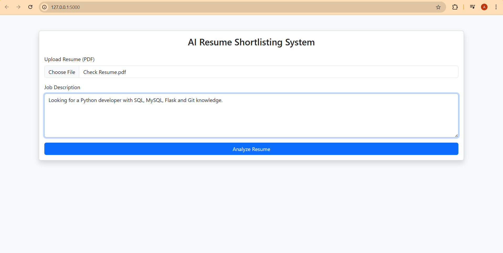
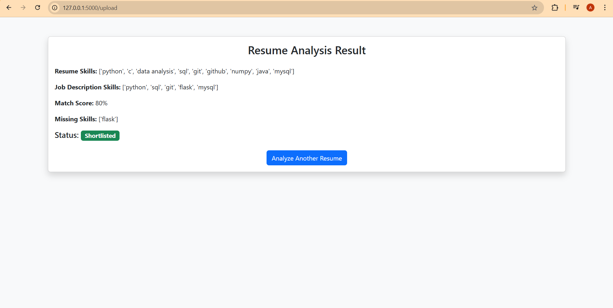
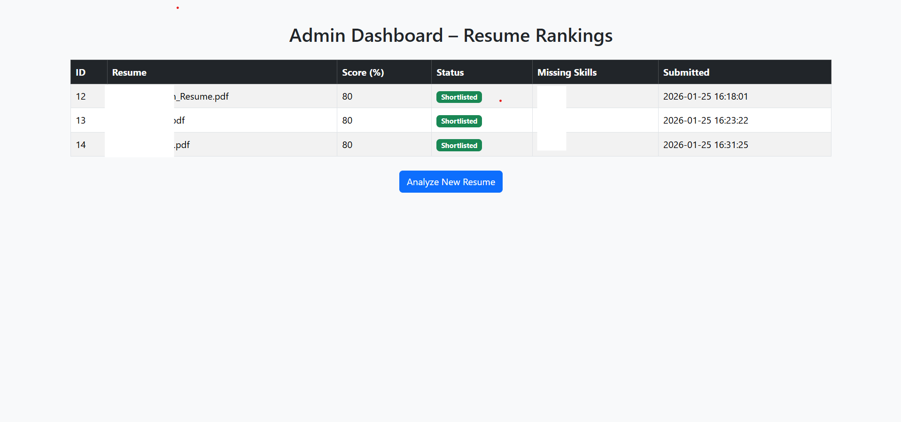

📌 AI Resume Shortlisting System

AI-powered web application that analyzes resumes against job descriptions, calculates a matching score, highlights missing skills, and shortlists candidates automatically.

🚀 Features

Resume upload (PDF)
Text extraction using NLP
Skill extraction from resume & job description
Match score calculation
Missing skill identification
Shortlisting decision
Results stored in MySQL
Admin dashboard to rank candidates

🧠 How It Works

User uploads a resume and enters a job description
System extracts text from PDF
Skills are extracted using rule-based NLP
Resume skills are matched with JD skills
Match score is calculated
Candidate is Shortlisted / Rejected
Results are stored and displayed on admin dashboard

🛠 Tech Stack

Backend: Python, Flask
Database: MySQL
NLP: pdfplumber, regex
Frontend: HTML, Bootstrap
Version Control: Git & GitHub

📊 Admin Dashboard

View all resumes
Rank by match score
Highlight shortlisted candidates

▶️ How to Run Locally
git clone https://github.com/your-username/ai-resume-shortlisting-system.git
cd ai-resume-shortlisting-system
pip install -r requirements.txt
python app.py

Open:
http://127.0.0.1:5000/

## 📷 Screenshots

📌 Future Enhancements

ML-based skill extraction
Resume ranking export (CSV/PDF)
Role-based access (Admin / HR)
Configurable shortlisting threshold

👨‍💻 Author

Archit Mahajan
B.Tech (AI)